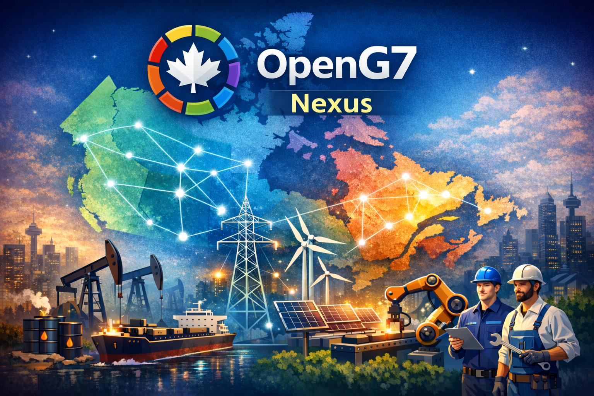

**Languages:** [English](#english) | [Français](#francais)

---

## English

# OpenG7

Open-source platform to explore and analyze interprovincial exchanges (Angular front-end + Strapi CMS).  
This monorepo contains the front-end, the CMS and shared API contracts.

## Getting started

1. Install dependencies: `yarn install`
2. Start Strapi: `yarn dev:cms` (local API on http://localhost:1337)
3. Start the Angular front-end: `yarn dev:web` (UI on http://localhost:4200)
4. Need a Strapi admin account? Set `STRAPI_ADMIN_EMAIL` / `STRAPI_ADMIN_PASSWORD` in your local `.env`, then create it from the admin screen.

> On Windows, `Run-Installer-pwsh.cmd` runs `install-dev-basics_robuste.ps1` to prepare the environment (PowerShell 5 in administrator mode, installation/validation of Node.js LTS, Yarn, Git, UTF-8 encoding) and then offers a small menu to launch the main `yarn` commands.

Detailed guides live in `docs/`:
- `docs/getting-started.md`: quick onboarding and useful scripts
- `docs/frontend/`: Angular signal-first architecture, `[data-og7]` selectors
- `docs/strapi/`: CMS conventions and idempotent seeds
- `docs/first-contribution.md`: checklist for a first PR
- `docs/roadmap.md`: public roadmap and priorities

## Owner Ops dashboard

The platform now includes an owner/admin operations dashboard:

- Frontend route: `/admin/ops`
- API endpoints:
  - `GET /api/admin/ops/health`
  - `GET /api/admin/ops/backups`
  - `GET /api/admin/ops/imports`
  - `GET /api/admin/ops/security`
- Access control: role `Admin` or `Owner` only
- Strapi policy: `global::owner-admin-ops` (applied on all `/api/admin/ops/*` routes)

The dashboard provides a consolidated view of runtime health, backup visibility, import throughput, and security indicators.

## Where does code live?

- Read CHARTER.md for the scope and non-goals of openg7-nexus.
- Use docs/ecosystem/ECOSYSTEM-MAP.md to find the canonical repo for a capability.
- If something is shared across repos, create a shared @openg7/* package instead of copying.
- Platform is orchestration/integration, not canonical domain logic.

## Contributing

Read `CONTRIBUTING.md` to understand the development workflow, the checks to run before opening a PR, and the secret management policy.  
The code of conduct (`CODE_OF_CONDUCT.md`) applies to all community spaces.  
A “first contribution” guide is available in `docs/first-contribution.md`.

### Public channels & support

- **GitHub Issues**: bugs, feature requests, documentation (templates provided, default label `needs-triage`).
- **GitHub Discussions**: general questions and exploratory ideas.
- **Support & governance**: see `SUPPORT.md` for response times, escalation, and the decision-making process.

### Community first steps

- Issue/PR templates are provided to speed up triage and clarify expectations.
- Labels `good first issue` and `help wanted` highlight topics suitable for new contributors.
- Please add screenshots for any visible UI change, and document configuration or security impacts.

## License & security

- License: MIT (`LICENSE`)
- Responsible disclosure: see `SECURITY.md` (contact: contact@openg7.org)

---

## Français

# OpenG7

Plateforme open source pour explorer et analyser les échanges interprovinciaux (front Angular + CMS Strapi).  
Ce monorepo regroupe le front-end, le CMS et les contrats d’API partagés.

## Pour commencer

1. Installez les dépendances : `yarn install`
2. Lancez Strapi : `yarn dev:cms` (API locale sur http://localhost:1337)
3. Lancez le front Angular : `yarn dev:web` (UI sur http://localhost:4200)
4. Besoin d’un compte admin Strapi ? Définissez `STRAPI_ADMIN_EMAIL` / `STRAPI_ADMIN_PASSWORD` dans votre `.env` local, puis créez-le via l’écran d’administration.

> Sous Windows, `Run-Installer-pwsh.cmd` exécute `install-dev-basics_robuste.ps1` pour préparer l’environnement (PowerShell 5 en mode administrateur, installation/validation de Node.js LTS, Yarn, Git, encodage UTF-8), puis propose un petit menu pour lancer les principales commandes `yarn`.

Les guides détaillés sont dans `docs/` :
- `docs/getting-started.md` : onboarding rapide et scripts utiles
- `docs/frontend/` : architecture Angular signal-first, sélecteurs `[data-og7]`
- `docs/strapi/` : conventions CMS et seeds idempotents
- `docs/first-contribution.md` : checklist pour une première PR
- `docs/roadmap.md` : feuille de route publique et priorités

## Tableau de bord Ops propriétaire

La plateforme inclut maintenant un tableau de bord d'exploitation pour owner/admin :

- Route frontend : `/admin/ops`
- Endpoints API :
  - `GET /api/admin/ops/health`
  - `GET /api/admin/ops/backups`
  - `GET /api/admin/ops/imports`
  - `GET /api/admin/ops/security`
- Contrôle d'accès : rôles `Admin` ou `Owner` uniquement
- Policy Strapi : `global::owner-admin-ops` (appliquée sur toutes les routes `/api/admin/ops/*`)

Ce tableau de bord centralise la santé runtime, la visibilité des backups, le suivi des imports et les indicateurs de sécurité.

## Ou vit le code?

- Lisez CHARTER.md pour la portee et les non-objectifs de openg7-nexus.
- Utilisez docs/ecosystem/ECOSYSTEM-MAP.md pour trouver le repo canonique.
- Si c'est partage entre repos, creez un package @openg7/* au lieu de copier.
- Platform = orchestration / integration, pas de logique canonique.

## Contribuer

Lisez `CONTRIBUTING.md` pour connaître le flux de développement, les vérifications à exécuter avant une PR et la politique de gestion des secrets.  
Le code de conduite (`CODE_OF_CONDUCT.md`) s’applique à tous les espaces communautaires.  
Un guide « première contribution » est disponible dans `docs/first-contribution.md`.

### Canaux publics & support

- **Issues GitHub** : bugs, demandes de fonctionnalités, documentation (modèles fournis, label `needs-triage` par défaut).
- **Discussions GitHub** : questions générales ou idées exploratoires.
- **Support & gouvernance** : consultez `SUPPORT.md` pour les temps de réponse, l’escalade et le processus de décision.

### Premiers pas communautaires

- Des modèles d’issues/PR sont fournis pour accélérer le tri et clarifier les attentes.
- Les labels `good first issue` et `help wanted` signalent des sujets adaptés aux nouveaux arrivants.
- Ajoutez des captures d’écran pour toute évolution UI perceptible et documentez les impacts de configuration ou de sécurité.

## Licence et sécurité

- Licence : MIT (`LICENSE`)
- Divulgation responsable : voir `SECURITY.md` (contact : contact@openg7.org)

