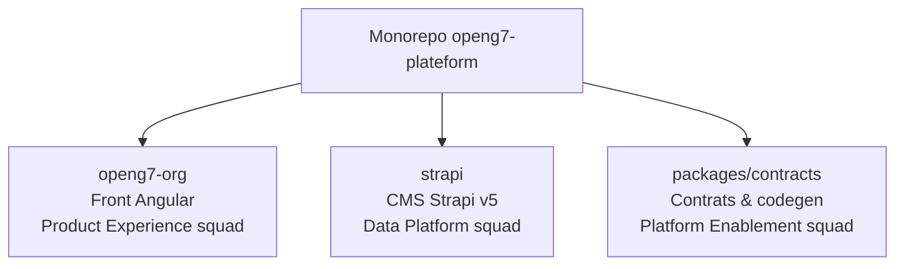

# Guide d'onboarding du monorepo OpenG7

Ce document condense les informations indispensables pour installer les dépendances, démarrer les services clés et identifier les points de contact par workspace. Utilisez-le comme porte d'entrée avant d'explorer la documentation détaillée présente dans `docs/`.

## 1. Pré-requis locaux

- **Node.js 20 LTS** (recommandé via [`nvm`](https://github.com/nvm-sh/nvm) ou [`fnm`](https://github.com/Schniz/fnm)).
- **Corepack** activé pour bénéficier de la version de Yarn fournie par le dépôt (`yarn@4.9.4`).
- **PostgreSQL** recommandé : Strapi v5 embarque le driver `pg` et le fichier `.env.example` cible Postgres pour un déploiement multi-pods, mais la configuration `DATABASE_CLIENT=sqlite` reste possible en local si vous souhaitez démarrer sans base externe. Ajustez les variables `DATABASE_*` en fonction du mode choisi. 【F:strapi/package.json†L16-L31】【F:strapi/config/database.ts†L15-L81】【F:strapi/.env.example†L36-L48】
- Aucune dépendance privée requise : l'installation se fait uniquement via les registres publics NPM.
- **Windows** : le script `install-dev-basics_robuste.ps1` (lancé via `Run-Installer-pwsh.cmd`) automatise l'installation des prérequis :
  - vérifie l'exécution en PowerShell 5 avec élévation administrateur et bascule la politique d'exécution en `RemoteSigned` ;
  - installe/valide `winget`, Git, Node.js LTS et Yarn, ajoute le dossier npm global au `PATH` et met à jour l'encodage console en UTF-8 ;
  - propose ensuite un menu pour lancer `yarn install`, `yarn dev:all` ou `yarn dev:web` sans avoir à saisir manuellement les commandes. 【F:install-dev-basics_robuste.ps1†L1-L194】【F:install-dev-basics_robuste.ps1†L400-L626】【F:install-dev-basics_robuste.ps1†L1043-L1122】

```bash
# Activer Corepack et vérifier la version de Yarn
corepack enable
yarn --version  # doit afficher 4.9.4
```

## 2. Installation des dépendances

1. Cloner le dépôt puis se placer à la racine :

   ```bash
   git clone git@github.com:openg7/openg7-plateform.git
   cd openg7-plateform
   ```

2. Installer les dépendances partagées par les workspaces :

   ```bash
   yarn install
   ```

   > Les modules sont installés en mode `node-modules` (voir `.yarnrc.yml`). Aucun `npm install` manuel n'est nécessaire.

## 3. Scripts de développement à connaître

| Commande | Rôle |
| --- | --- |
| `yarn dev:web` | Lance l'application Angular (`openg7-org`) avec HMR sur http://localhost:4200. |
| `yarn --cwd openg7-org serve:ssr:openg7-org` | Démarre le serveur SSR Express construit dans `dist/` (après `yarn build:preprod`). |
| `yarn dev:cms` | Démarre le workspace Strapi (`@openg7/strapi`) avec rechargement automatique. |
| `yarn dev:all` | Exécute simultanément le front et Strapi via `concurrently` pour un cycle full-stack. |
| `yarn --cwd strapi strapi develop` | (Optionnel) Lance Strapi directement depuis son workspace si vous préférez travailler hors du script racine. |
| `yarn --cwd packages/contracts run codegen` | Regénère les types et clients API à partir des schémas exposés par les workspaces Strapi. |

## 4. Enchaînement recommandé pour lancer les services

1. **Initialiser les variables d'environnement** : copiez les fichiers `.env.example` fournis (`strapi/.env.example`, `openg7-org/.env.example`) puis ajustez les secrets (`STRAPI_ADMIN_*`, `STRAPI_API_READONLY_TOKEN`, `PREVIEW_TOKEN`, etc.). Les guides dédiés dans `docs/tooling/environments.md` détaillent la rotation de ces valeurs.
2. **Démarrer Strapi** :

   ```bash
   yarn dev:cms
   ```

   - Interface admin : http://localhost:1337/admin
   - API REST : http://localhost:1337/api

   > Les seeds (`strapi/src/seed/*`) s'exécutent automatiquement en environnement de développement.

   > Pour valider les scénarios multi-instances, configurez `DATABASE_CLIENT=postgres` dans `strapi/.env` puis relancez Strapi : la nouvelle configuration `config/database.ts` utilisera automatiquement le driver Postgres et le pool de connexions adapté. 【F:strapi/.env.example†L5-L15】【F:strapi/config/database.ts†L42-L81】

3. **Lancer le front Angular** depuis un nouveau terminal :

   ```bash
   yarn dev:web
   ```

   - Application SSR/CSR : http://localhost:4200
   - Le front consomme par défaut `strapi` via `API_URL` (configuré dans `openg7-org/.env`). Adaptez ce fichier si vous pointez vers un endpoint distant.

   > Pour tester l'exécution SSR côté Node, exécutez `yarn --cwd openg7-org serve:ssr:openg7-org` après un `yarn build:preprod`. Le serveur Express lit directement `process.env` et permet de simuler le runtime containerisé. 【F:openg7-org/package.json†L6-L32】【F:openg7-org/src/server.ts†L1-L126】

4. **Option tout-en-un** : utilisez `yarn dev:all` si vous souhaitez que le front et Strapi démarrent ensemble.

## 5. Diagramme des workspaces et responsabilités



## 6. Où approfondir ensuite ?

- **Front-end Angular** : `docs/frontend/` (architecture, SSR, sélecteurs de composants, i18n, etc.).
- **Strapi** : `docs/strapi/` et `docs/strapi-workspaces.md` pour connaître les conventions et responsabilités côté CMS.
- **Tooling partagé** : `docs/tooling/` (scripts CLI, conventions CI/CD, linting personnalisé).
- **Contrats API** : `packages/contracts/README.md` pour automatiser la génération des clients et schémas TypeScript.

Gardez ce guide sous la main lors de l'onboarding : il sert de checklist initiale avant de plonger dans les guides spécialisés.
